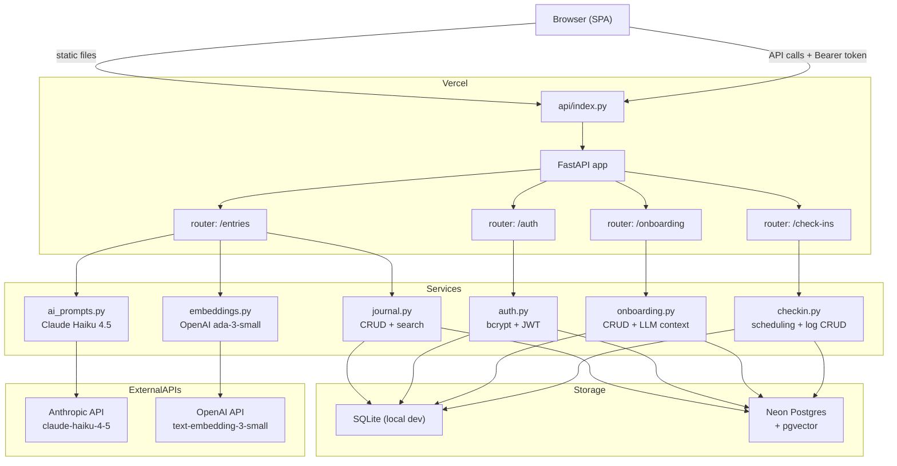

# ARCHITECTURE.md
> Last updated: 2026-08-23 — reflects actual codebase state

---

## Application Overview

Reflection Buddy is a full-stack AI journaling platform. Users write daily journal entries guided by structured reflection questions. The AI layer generates personalised follow-up questions based on what the user is writing right now, finds semantically similar past entries via vector search, and uses the user's onboarding profile (goals, stressors, habits, baselines) to personalise every LLM call.

The system is deployed as a single Vercel serverless function that serves both the FastAPI backend and the static frontend.

---

## Architecture Diagram

```
User (Browser)
    │
    ├── Static files served by Vercel (index.html, app.js, styles.css)
    │
    └── API calls → Vercel Serverless Function
                        │
                        └── FastAPI (backend/app/main.py)
                                │
                                ├── /api/v1/auth/*         → Auth router
                                ├── /api/v1/entries/*      → Journal router
                                ├── /api/v1/onboarding/*   → Onboarding router
                                └── /api/v1/check-ins/*    → Goal Check-In router
                                        │
                                        ├── Services layer
                                        │     ├── auth.py          (bcrypt + JWT)
                                        │     ├── journal.py        (CRUD + search)
                                        │     ├── ai_prompts.py     (Claude API)
                                        │     ├── embeddings.py     (OpenAI API)
                                        │     ├── onboarding.py     (CRUD + LLM context)
                                        │     └── checkin.py        (scheduling + log CRUD)
                                        │
                                        ├── SQLAlchemy ORM
                                        │
                                        └── Database
                                              ├── Local dev:  SQLite
                                              └── Production: Neon (Postgres + pgvector)
```

---

## Repository Structure

```
reflection-buddy/
├── api/
│   ├── index.py            Vercel entry point — adds backend/ to sys.path, re-exports app
│   └── requirements.txt    Production dependencies (mirrors backend/requirements.txt)
│
├── backend/
│   ├── requirements.txt    Local dev dependencies
│   └── app/
│       ├── main.py         FastAPI app factory, lifespan, CORS, startup migrations
│       ├── config.py       Settings (pydantic-settings, reads .env)
│       ├── database.py     SQLAlchemy engine, SessionLocal, Base, get_db()
│       │
│       ├── models/
│       │   ├── user.py         User table
│       │   ├── journal.py      JournalEntry table
│       │   ├── onboarding.py   UserOnboarding, UserGoal, UserStressor, UserHabit tables
│       │   └── checkin.py      HabitLog table (UNIQUE user_id+habit_id+date)
│       │
│       ├── schemas/
│       │   ├── auth.py         UserCreate, UserResponse, Token
│       │   ├── journal.py      JournalEntry*, PromptResponse, SmartPromptRequest/Response,
│       │   │                   SemanticSearchResponse
│       │   ├── onboarding.py   Goal/Stressor/Habit create+response schemas, enums,
│       │   │                   OnboardingCreate/Patch/Response
│       │   └── checkin.py      HabitLogCreate/Update/Response, TodayCheckIn,
│       │                       TodayCheckInsResponse
│       │
│       ├── routers/
│       │   ├── auth.py         POST /register, POST /login, GET /me
│       │   ├── journal.py      CRUD + GET /prompts + POST /prompts/smart + GET /search
│       │   ├── onboarding.py   POST / GET / PATCH /onboarding
│       │   └── checkin.py      GET /check-ins/today, POST /check-ins, PUT /check-ins/{id}
│       │
│       └── services/
│           ├── auth.py         hash_password, verify_password, create_access_token,
│           │                   get_current_user (FastAPI dependency)
│           ├── journal.py      create/get/update/delete entry, get_entries,
│           │                   get_reflection_prompts, get_smart_prompts,
│           │                   semantic_search, _store_embedding
│           ├── ai_prompts.py   ReflectionPromptGenerator (mood-based), generate_smart_prompts
│           │                   (context-aware with similar entries)
│           ├── embeddings.py   EmbeddingService — OpenAI text-embedding-3-small,
│           │                   build_entry_text, format_for_sql
│           ├── onboarding.py   save/get/patch onboarding, build_llm_context()
│           └── checkin.py      _is_due(), get_today_check_ins(), create_log(), update_log()
│
├── frontend/
│   ├── index.html          Single-page app — all views in one file (hidden/shown by JS)
│   ├── js/app.js           All frontend logic: auth, journal CRUD, onboarding wizard,
│   │                       smart prompts, semantic search API calls
│   └── css/styles.css      Custom CSS (Tailwind via CDN handles layout)
│
└── vercel.json             Routes everything to api/index.py
```

---

## Authentication Flow

**Provider:** Custom — bcrypt passwords + PyJWT (HS256)
**Token storage:** `localStorage` under key `rb_token`
**Token expiry:** 7 days (configurable via `ACCESS_TOKEN_EXPIRE_MINUTES`)

### Login flow
```
1. POST /api/v1/auth/register  { email, password }
      → hash_password(bcrypt) → insert User row → return UserResponse

2. POST /api/v1/auth/login     { email, password }
      → verify_password(bcrypt) → create_access_token(JWT) → return { access_token }

3. Client stores token in localStorage
   Every subsequent request: Authorization: Bearer <token>
```

### Route protection
- `get_current_user` FastAPI dependency on all non-auth routes
- Extracts Bearer token → `_decode_token(PyJWT)` → fetches User from DB
- Returns 401 on expired/invalid token
- Frontend `handleUnauthorized()` clears token and redirects to auth view on any 401

### Onboarding gate
```
bootstrapAuth()
  → GET /auth/me (validate token)
  → GET /onboarding (check completion)
  → if null  → showOnboarding()
  → if exists → showDashboard()
```

### User ownership
All journal queries filter by `user_id = current_user.id`. Cross-user access is structurally impossible at the service layer.

---

## Journal Flow

```
User writes entry in form
    │
    ├── Optional: click "✦ Generate smart prompts"
    │       POST /entries/prompts/smart { content }
    │           → EmbeddingService.generate(content)     [OpenAI API]
    │           → semantic_search() — find 3 similar past entries [pgvector]
    │           → build_llm_context() — pull onboarding profile
    │           → generate_smart_prompts() — Claude Haiku 4.5
    │           → update reflection question labels in UI
    │
    └── User clicks "Save Entry"
            POST /entries { content, mood, energy_level, q_* }
                → JournalEntryCreate schema validation
                → journal_service.create_entry() → INSERT journal_entries
                → _store_embedding()
                      → EmbeddingService.build_entry_text()
                      → EmbeddingService.generate()        [OpenAI API]
                      → UPDATE journal_entries SET embedding = vector
                → return JournalEntryResponse
```

### Files involved
| Step | File |
|---|---|
| Schema validation | `schemas/journal.py` |
| Business logic | `services/journal.py` |
| Embedding generation | `services/embeddings.py` |
| AI questions | `services/ai_prompts.py` |
| DB write | SQLAlchemy → `models/journal.py` |
| API route | `routers/journal.py` |
| Frontend | `frontend/js/app.js` → `handleFormSubmit`, `handleSmartPrompts` |

---

## Database Flow

```
Frontend (fetch + authHeaders)
    │
    └── FastAPI Router (routers/*.py)
            │
            └── Service Layer (services/*.py)
                    │
                    └── SQLAlchemy ORM Session (database.py → get_db())
                            │
                            ├── Local:  SQLite file (journal.db)
                            └── Prod:   Neon Postgres (pgvector extension)
```

### Startup migrations (main.py `_run_column_migrations`)
Runs on every cold start. Idempotent `ALTER TABLE` statements add new columns to existing tables without touching data. Also enables `pgvector` extension and adds `embedding vector(1536)` column on Postgres.

---

## Future Architecture

### Semantic Search — **Implemented**
- pgvector column on `journal_entries`
- `GET /entries/search?q=` endpoint live
- Similar entries used in smart prompt generation

### Smart Contextual Prompts — **Implemented**
- `POST /entries/prompts/smart` — takes current entry text, finds similar past entries, generates Claude questions

### Goal Check-In / Habit Logging — **Implemented (Phase 1)**
`habit_logs` table is live with UNIQUE(user_id, habit_id, date). Scheduling rules (`schedule_type`, `schedule_days`) live on `user_habits`. GET /check-ins/today returns only today's due habits merged with existing log state. POST /check-ins is idempotent (upsert). Frontend shows a Goal Check-In section below the journal form with Yes/Not today buttons and optional notes.

**Still planned:** streak calculation, habit-mood correlation, x_per_week scheduling enforcement.

### Goal Progress Analysis — **Planned**
Goals are stored in `user_goals` but no linkage to journal entries or progress tracking exists. Future: `goal_progress_events` table, LLM-based goal-entry alignment scoring.

### RAG (Journal Memory) — **Planned**
Future: embed all historical entries → retrieve relevant context for any query → generate answers about patterns, causes, progress. `build_llm_context()` is the foundation.

### Analytics / Trend Charts — **Planned**
Mood over time, energy trends, baseline vs. current comparison. All raw data exists; no aggregation endpoints or chart components yet.

### Weekly / Monthly AI Summaries — **Planned**
Batch job or on-demand endpoint to summarise a date range using retrieved entries + onboarding context.

---

## Mermaid Diagram



---

## Technical Notes

| Decision | Rationale |
|---|---|
| SQLite (local) / Postgres (prod) | Zero-config local dev; pgvector only activates on Postgres |
| Custom bcrypt/JWT over Clerk | Portfolio value — interviewers ask "walk me through your auth"; demonstrates full understanding |
| Embedding column via raw SQL migration | Avoids SQLAlchemy type compatibility issue with pgvector on SQLite; startup migration is idempotent |
| Single-page app (no framework) | Keeps frontend simple; no build step; easy for collaborators to read |
| `build_llm_context()` as standalone fn | Any future LLM call (summaries, RAG, goal analysis) can import this without touching HTTP layer |
| Haiku 4.5 for question generation | ~$0.0000017/request; negligible cost at friend-group scale; quality sufficient for follow-up questions |
| OpenAI for embeddings | Anthropic has no embedding API; text-embedding-3-small is $0.02/1M tokens, industry standard |
